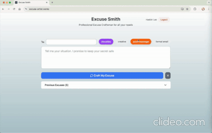
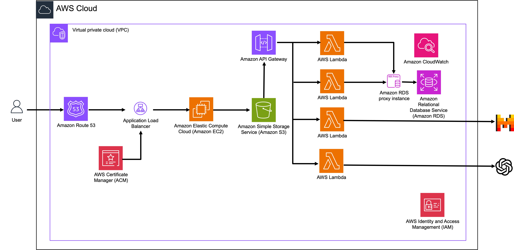

# Excuse Smith

An AI-powered excuse generator that creates both plausible and creative excuses as vibe and between formal email and short message as format, tailored to your needs, complete with matching images and email integration.

## Demo

## Architecture

## Features

- **Custom Excuse Generation**: Generate unique excuses using OpenAI and Mistral AI, with adjustable settings for creativity and formality
- **Visual Enhancement**: AI-generated images to complement your excuses
- **Style Preferences**: Toggle between creative and plausible excuses, formal emails and short messages
- **Google Integration**:
  - Seamless login with Google authentication
  - Direct excuse delivery through Gmail
- **History Management**: Store and retrieve your previous excuses and generated images
- **User Convenience**:
  - One-click copy functionality for quick excuse sharing
  - Preview feature to review your excuse before sending

## Tech Stack

- **Frontend**: React.js
- **Backend Services**: AWS including:
  - Lambda
  - API Gateway
  - S3
  - RDS
  - EC2
  - Other AWS services (list specific services used)
- **Authentication**: Google OAuth
- **AI Integration**:
  - Mistral AI for excuse generation
  - OpenAI for cartoon generation based on crafted excuse.

## Contributing

We welcome contributions to Excuse Smith! Please follow these steps:

1. Fork the repository
2. Create your feature branch (`git checkout -b feature/AmazingFeature`)
3. Commit your changes (`git commit -m 'Add some AmazingFeature'`)
4. Push to the branch (`git push origin feature/AmazingFeature`)
5. Open a Pull Request

## License

This project is licensed under the MIT License
